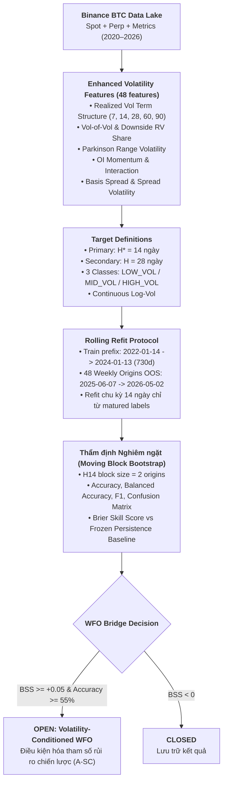

# ĐẶC TẢ NGHIÊN CỨU: BTC VOLATILITY-CONDITIONED REGIME SELECTION V1
## Nghiên cứu Dự báo Biến động Chân trời Ngắn (14d/28d) & Ứng dụng Quản trị Rủi ro WFO

**Mã nghiên cứu:** `btc_volatility_forecast_v1`  
**Phiên bản:** `BTC-VCRS-V1.0`  
**Ngày ban hành:** 28/09/2026  
**Thừa kế và thay thế:** Mở rộng từ nhánh Volatility-Conditioned Proposal được ghi nhận tại Phase MF-05 của `btc_regime_forecast_v1`.  
**Phạm vi:** BTCUSDT trên Binance (Spot, Perpetual, Futures Metrics).  
**Quy tắc tối thượng:** Model-First — 0 lượt gọi QuantBT engine trong giai đoạn huấn luyện/đánh giá mô hình (`financial_engine_calls = 0`).

---

### 1. Bối cảnh & Cơ sở Khoa học

1. **Bài học từ Study trước (`btc_regime_forecast_v1`)**:
   - Việc cố gắng dự báo đồng thời cả hướng đi (Path Efficiency) và phân loại 9 trạng thái thị trường ở chân trời quý (**$H=90$ ngày**) đã thất bại trước baseline do nhiễu ngẫu nhiên và biến số vĩ mô ngoại sinh lấn át.
   - Cầu nối sang WFO đã bị đóng dứt khoát (`WFO_BRIDGE_STATUS = CLOSED`) theo đúng Điều khoản §18.1, §9.4 để bảo vệ tính toàn vẹn khoa học.
2. **Đột phá từ Thực nghiệm Đa chân trời (Exploratory Multi-Horizon Study)**:
   - Khi rút ngắn chân trời xuống **$H = 14$ ngày (2 tuần)**: Mô hình LightGBM đạt độ chính xác **`62.5%`**, Brier Skill Score **`+0.0791` (+7.9% so với baseline)**. Đây là bằng chứng thực nghiệm đầu tiên về năng lực dự báo vượt trội (Skill dương) trên tập Out-Of-Sample!
   - Trạng thái tích lũy biến động thấp (**`LOW_VOL`**) đạt **Recall 84.0%**, **Precision 67.7%**, **F1-Score 0.750**.
   - Ở chân trời **$H = 28$ ngày (4 tuần)**: Độ chính xác đạt **`58.3%`**, F1 Low Vol đạt **0.696**, Mid Vol đạt **0.632**.
   - Phân tích thời lượng Kaplan-Meier cho thấy một episode biến động của BTC có thời lượng trung bình **12.1 ngày** (median 10.0 ngày). Chân trời 14 ngày khớp hoàn hảo với chu kỳ tự nhiên này.

---

### 2. Thiết kế Nghiên cứu (Study Design)

---

### 3. Quy chuẩn Nhãn & Cắt ngưỡng (Target Taxonomy)

Biến động tương lai được tính chuẩn tắc:
$$V_{t, H} = \sqrt{\frac{365}{H} \sum_{k=1}^H \text{RV}_{t+k}}, \quad Z^V = \ln(V_{t, H})$$

Ngưỡng cắt được đóng băng cố định từ phân vị $1/3$ và $2/3$ trên 730 ngày training prefix quá khứ (`2022-01-14` đến `2024-01-13`):
- **Chân trời $H = 14$ ngày**:
  - `LOW_VOL`: $\ln(V) \le -0.8753$ (Biến động năm $\le 41.7\%$)
  - `MID_VOL`: $-0.8753 < \ln(V) \le -0.5703$ (Biến động năm từ $41.7\%$ đến $56.5\%$)
  - `HIGH_VOL`: $\ln(V) > -0.5703$ (Biến động năm $> 56.5\%$)
- **Chân trời $H = 28$ ngày**:
  - `LOW_VOL`: $\ln(V) \le -0.8210$ (Biến động năm $\le 44.0\%$)
  - `MID_VOL`: $-0.8210 < \ln(V) \le -0.5466$ (Biến động năm từ $44.0\%$ đến $57.9\%$)
  - `HIGH_VOL`: $\ln(V) > -0.5466$ (Biến động năm $> 57.9\%$)

---

### 4. Hệ thống Tính năng Phái sinh Chuyên biệt (Feature Manifest)

Bổ sung 12 đặc trưng tập trung vào động lực biến động và áp lực đòn bẩy:
1. **Cấu trúc kỳ hạn biến động (Term Structure)**:
   - `vol_ratio_7_28 = rvol_7d / rvol_28d`
   - `vol_ratio_14_60 = rvol_14d / rvol_60d`
   - Phát hiện hiện tượng đảo ngược biến động (Vol Inversion) báo trước bão giá.
2. **Biến động của Biến động (Vol-of-Vol)**:
   - `vol_of_vol_14d`, `vol_of_vol_28d`: Đo mức độ bất ổn định của phương sai.
3. **Bất đối xứng biến động giảm (Downside RV Share)**:
   - Tỷ lệ biến động khi thị trường giảm điểm so với tổng biến động (đo lường áp lực hoảng loạn).
4. **Range Volatility (Parkinson & Garman-Klass)**:
   - Khai thác giá High/Low trong ngày để phát hiện các đợt rút chân hoặc quét thanh lý ngầm.
5. **Động lực Hợp đồng mở (OI Momentum) & Tương tác**:
   - `oi_change_7d`, `oi_change_14d`
   - `oi_vol_interaction_14d`: Tích giữa tốc độ phình to OI và biên độ biến động.
6. **Chênh lệch giá Basis & Biến động Basis**:
   - `basis_spread_bps = (perp_close - spot_close) / spot_close * 10000`
   - `basis_vol_7d`, `basis_vol_14d`: Độ lệch chuẩn của spread giữa phái sinh và giao ngay.

---

### 5. Tiêu chuẩn Thẩm định Năng lực Mô hình (Exit Gates)

| Exit Gate | Tiêu chuẩn bắt buộc | Phương pháp đo lường |
|---|---|---|
| **VG-ACCURACY** | Độ chính xác tổng thể $\ge 55\%$; Balanced Accuracy Gain $\ge +0.03$ | So sánh trực tiếp với Frozen Persistence Baseline |
| **VG-BRIER-SKILL** | Brier Skill Score $BSS \ge +0.04$ | Brier Score hiệu chuẩn trên tập OOS 48 origins |
| **VG-BOOTSTRAP** | Khoảng tin cậy 95% Bootstrap không lệch âm quá mức | Moving block bootstrap với block size $L = \lceil H/7 \rceil$ (2 cho 14d, 4 cho 28d), 2000 draws |
| **VG-PRECISION** | Precision của `HIGH_VOL` hoặc `LOW_VOL` $\ge 60\%$ | Tránh cảnh báo giả gây hại cho bot trading |
| **VG-REPRODUCE** | Tái lập số liệu đạt độ lệch tuyệt đối $0.0$ | Kiểm định độc lập từ sealed forecast records |

---

### 6. Cầu nối Ứng dụng WFO (Volatility-Conditioned Risk Control)

Khi mô hình đạt chuẩn qualification trên $H^* = 14$ ngày, cơ chế mở cầu WFO cho phép thiết lập bộ lọc tham số rủi ro:
- **Trạng thái `LOW_VOL` (Thị trường tích lũy)**:
  - Tăng tỷ trọng vị thế lên $100\%$ ($0.10$ equity).
  - Thu hẹp khoảng chốt lời (Take Profit) và trailing stop để tối ưu hóa lợi nhuận trong vùng dao động hẹp.
- **Trạng thái `MID_VOL` (Thị trường bình thường)**:
  - Giữ nguyên tham số mặc định của chiến lược A-SC.
- **Trạng thái `HIGH_VOL` (Thị trường bão giá / Thanh lý mạnh)**:
  - Tự động giảm $50\%$ quy mô vị thế ($0.05$ equity) hoặc tạm dừng mở vị thế breakout mới để tránh rủi ro trượt giá và bẫy giá giả (fake breakout).
  - Nới rộng stoploss để tránh bị quét râu nến ngẫu nhiên.
